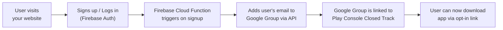
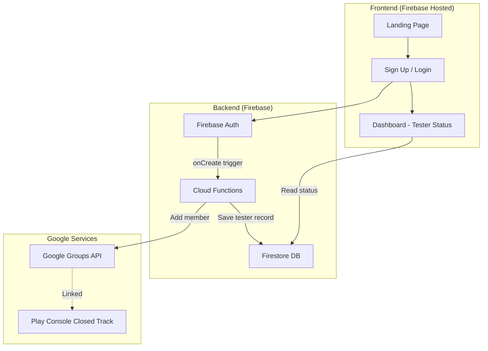
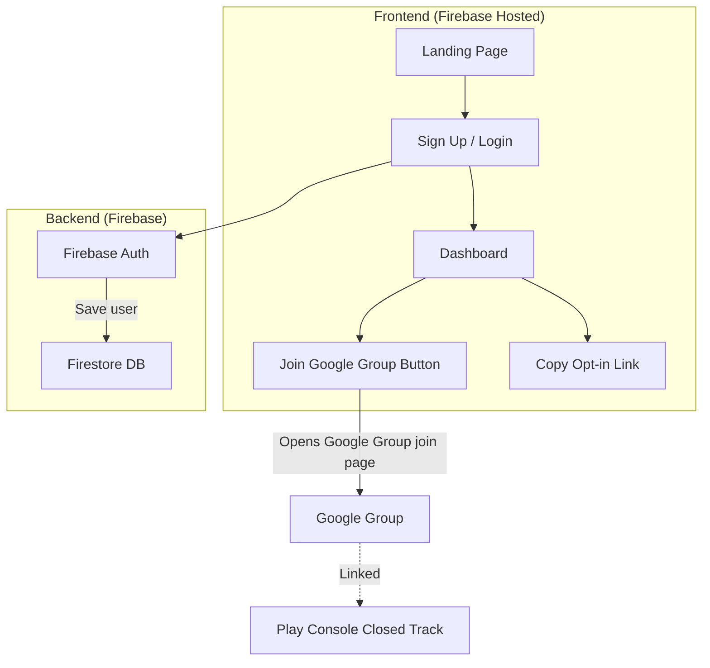

# Play Store Closed Testing Management Portal

Build a premium web application where users can sign up / log in and **automatically get enrolled** as closed testers for your Play Store app — powered by Firebase + Google Groups.

---

## How Play Store Closed Testing Actually Works

Before we build, here's the end-to-end flow so you understand every piece:



### Key Concepts

| Concept | What it is |
|---|---|
| **Closed Testing Track** | A special release track in Google Play Console where only approved testers can download your app |
| **Google Group** | An email group (e.g. `myapp-testers@yourdomain.com`) — Play Console uses this to know who's a tester |
| **Firebase Auth** | Handles user sign-up/login on your website |
| **Firebase Cloud Functions** | Server-side code that runs automatically when a user signs up — adds their email to the Google Group |
| **Opt-in Link** | A special URL from Play Console that testers must click to officially join the testing program |

---

## Prerequisites You Need Before We Build

> [!IMPORTANT]
> You need these accounts/services set up. Tell me which ones you already have.

1. **Google Play Console** account with an app that has a Closed Testing track configured
2. **Firebase project** (free Spark plan works for Auth; Blaze plan needed for Cloud Functions)
3. **Google Workspace** or **Cloud Identity Free** account — this is **required** to programmatically add members to a Google Group via API. Consumer `@googlegroups.com` groups do **NOT** have API access.
4. A **Google Group** created under your Workspace/Cloud Identity domain (e.g. `beta-testers@yourdomain.com`)
5. That Google Group added to your Play Console Closed Testing track

---

## Open Questions

> [!IMPORTANT]
> Please answer these so I can tailor the implementation:

1. **Do you have Google Workspace or Cloud Identity?** 
   - If yes → we can fully automate adding users to Google Groups via API
   - If no → we have two alternatives:
     - **Option A**: Use Cloud Identity Free (free, requires domain verification)
     - **Option B**: Skip the Google Group API and instead store testers in Firestore + show a "Join Google Group" button that links to the group's join page (semi-automated)

2. **What sign-in methods do you want?**
   - Email/Password only
   - Google Sign-In only
   - Both Email/Password + Google Sign-In

3. **Do you have a Firebase project already?** If yes, share the project ID and I'll configure accordingly.

4. **Do you have a custom domain** or will this be hosted on Firebase Hosting (e.g. `yourproject.web.app`)?

5. **Do you want an Admin Dashboard** where you can see all registered testers, their status, etc.?

---

## Proposed Architecture

### Two Approaches (depending on your answer to Question 1)

#### Approach A: Full Automation (Requires Google Workspace / Cloud Identity)



- User signs up → Cloud Function auto-adds email to Google Group → user is automatically a tester
- Fully hands-off after setup

#### Approach B: Semi-Automated (No Google Workspace needed)



- User signs up → gets guided to manually join the Google Group via a link → then click the opt-in link
- Simpler setup, no Workspace needed

---

## Proposed Changes

### 1. Frontend Web App

#### [NEW] `index.html`
- Premium landing page with hero section explaining the beta program
- Sign up / Login forms with Firebase Auth integration
- Post-login dashboard showing tester enrollment status
- Opt-in link section with copy-to-clipboard functionality
- Responsive, dark-mode design with glassmorphism effects

#### [NEW] `index.css`
- Full design system: CSS custom properties, typography (Google Fonts), color palette
- Glassmorphism card styles, gradient backgrounds
- Micro-animations (button hovers, card reveals, status indicators)
- Responsive breakpoints for mobile/tablet/desktop

#### [NEW] `app.js`
- Firebase SDK initialization (Auth, Firestore)
- Sign up / Login flow (email+password and/or Google Sign-In)
- Post-auth dashboard rendering
- Tester status polling from Firestore
- Opt-in link display and clipboard copy

#### [NEW] `firebase.json`
- Firebase Hosting configuration
- Rewrites and headers

---

### 2. Firebase Cloud Functions (Backend)

#### [NEW] `functions/index.js`
- `onUserCreated` — triggered on Firebase Auth `user.onCreate`:
  - Saves user record to Firestore (`testers` collection) with status `pending`
  - **If Approach A**: Calls Google Groups API to add the user's email as a member, updates status to `enrolled`
  - **If Approach B**: Sets status to `awaiting_group_join` — user must manually join
- `getTesterStatus` — HTTP callable function for the frontend to check enrollment status

#### [NEW] `functions/package.json`
- Dependencies: `firebase-functions`, `firebase-admin`, `googleapis` (for Approach A)

---

### 3. Firestore Database Schema

```
testers/
  └── {userId}/
        ├── email: string
        ├── displayName: string
        ├── signUpDate: timestamp
        ├── status: "pending" | "enrolled" | "awaiting_group_join" | "error"
        ├── googleGroupAdded: boolean
        ├── optInClicked: boolean (self-reported)
        └── errorMessage: string (if any)
```

#### [NEW] `firestore.rules`
- Users can only read their own tester document
- Only Cloud Functions (admin) can write to tester documents

---

### 4. Admin Dashboard (Optional — if you want it)

#### [NEW] `admin.html`
- Protected page (admin-only access)
- Table of all registered testers with search/filter
- Status indicators (pending, enrolled, error)
- Manual actions (retry group add, remove tester)
- Export testers list as CSV

---

## Step-by-Step Setup Guide (What You'll Need to Do)

### Before I code:
1. Create a Firebase project (if you don't have one)
2. Enable Firebase Auth (Email/Password + Google provider)
3. Enable Firestore
4. Enable Firebase Hosting
5. **For Approach A only**:
   - Set up Cloud Identity Free or Google Workspace
   - Create a Google Group under your domain
   - Create a Service Account with domain-wide delegation
   - Grant `https://www.googleapis.com/auth/admin.directory.group.member` scope

### After I code:
1. Configure your Firebase project credentials in the app
2. Deploy Cloud Functions (`firebase deploy --only functions`)
3. Deploy the web app (`firebase deploy --only hosting`)
4. Link your Google Group to the Play Console Closed Testing track
5. Share the opt-in URL on your dashboard

---

## Verification Plan

### Automated Tests
- Test Firebase Auth sign-up/login flow in the browser
- Test Cloud Function triggers correctly on user creation
- Verify Firestore document is created with correct schema

### Manual Verification
- Sign up with a test email and verify:
  - User appears in Firebase Auth console
  - Firestore document is created with `pending` status
  - **(Approach A)**: Email is added to Google Group, status updates to `enrolled`
  - **(Approach B)**: "Join Group" button works, links to correct Google Group
- Test the opt-in link flow end-to-end
- Test on mobile for responsive design

---

## What I'll Build First

Once you approve, I'll start with:
1. ✅ The complete frontend (landing page + auth + dashboard) — fully functional and beautiful
2. ✅ Firebase configuration files
3. ✅ Cloud Functions code
4. ✅ Firestore security rules
5. ✅ Setup instructions for connecting everything

> [!NOTE]
> The frontend will be fully working locally. To make the Google Group automation work, you'll need to deploy to Firebase and configure the service account credentials — I'll provide step-by-step instructions for that.
